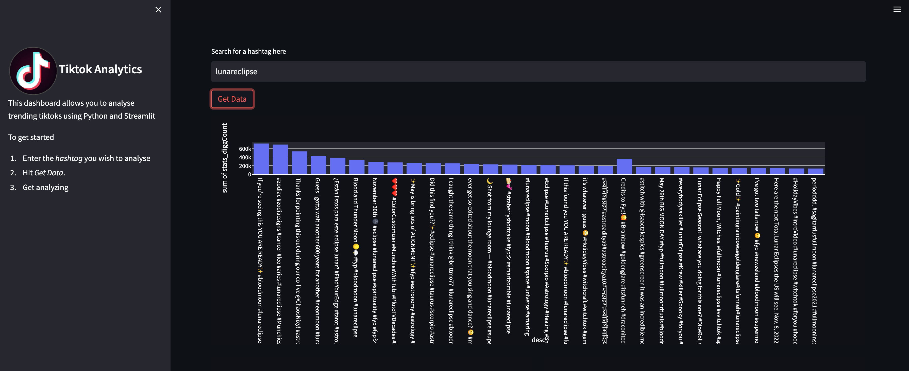

# TikTok Analytics Web App in StreamLit

## Overview

This repository helps to build a Data Analytics App in Streamlit using python code.

*Note that this code builds on the **Unofficial TikTok Api v4.1.0***

With this Steamlit app, you can visualise the statistics of latest trending videos filtered by hashtag.

The code involves:

1. Building a real time feed from TikTok
2. Preprocessing that data using an ETL Pipeline
3. Creating a Streamlit dashboard to visualise the data

## Application

Below is how the web application looks like:

